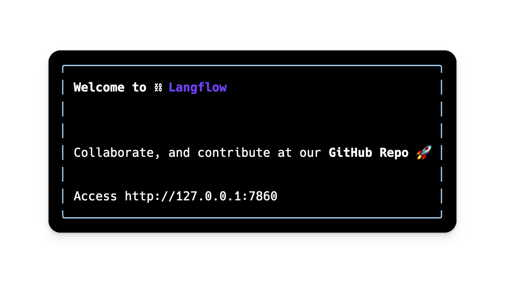

## **DataStax Langflow** {#a3b4bd8dec5a49ebbfca4828492133e9}


---


The easiest way to get started with Langflow is through the DataStax Cloud Service!


**DataStax Langflow** is a hosted version of Langflow integrated with [AstraDB](https://www.datastax.com/products/datastax-astra). Be up and running in minutes with no installation or setup required. [Sign up for free](https://langflow.datastax.com/).


## **Install Langflow Locally** {#ef364ee864c545649d248113ad7d3038}


---


:::caution

Langflow **requires** Python version 3.10 or greater and [pip](https://pypi.org/project/pip/) or [pipx](https://pipx.pypa.io/stable/installation/) to be installed on your system.

:::


Install Langflow with pip:


```bash
python -m pip install langflow -U
```


Install Langflow with pipx:


```bash
pipx install langflow --python python3.10 --fetch-missing-python
```


Pipx can fetch the missing Python version for you with `--fetch-missing-python`, but you can also install the Python version manually. Use `--force-reinstall` to ensure you have the latest version of Langflow and its dependencies.


## Having a problem? {#86a16dad1d6e481cafb90efea2b9ff93}


---


If you encounter a problem, see [Common Installation Issues](/getting-started-common-installation-issues).


To get help in the Langflow CLI:


```bash
python -m langflow --help
```


## Run Langflow {#d318c4d486b74f5383c45b4f6859dcaa}


---


1. To run Langflow, enter the following command.


```bash
python -m langflow run
```


2. Confirm that a local Langflow instance starts by visiting `http://127.0.0.1:7860` in a Chromium-based browser.





3. Continue on to the [Quickstart](/getting-started-quickstart).

